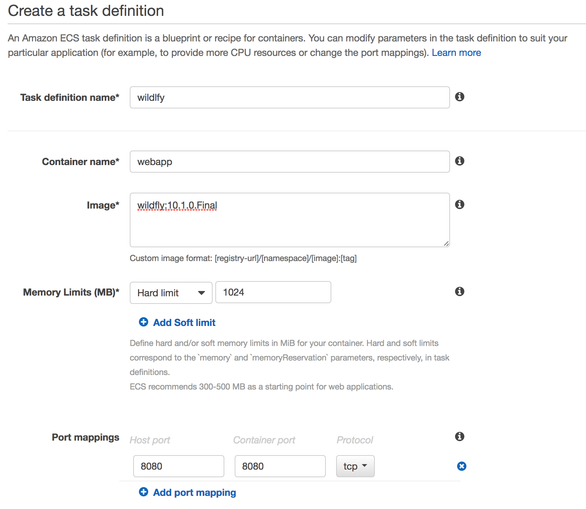
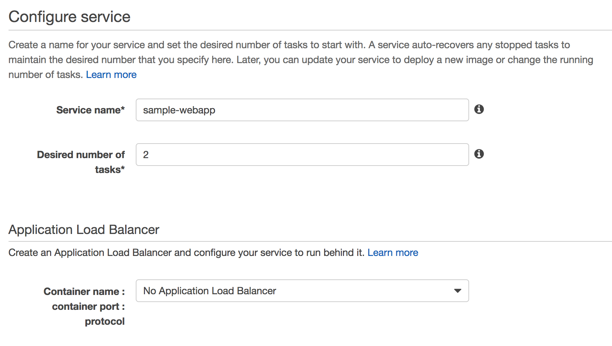
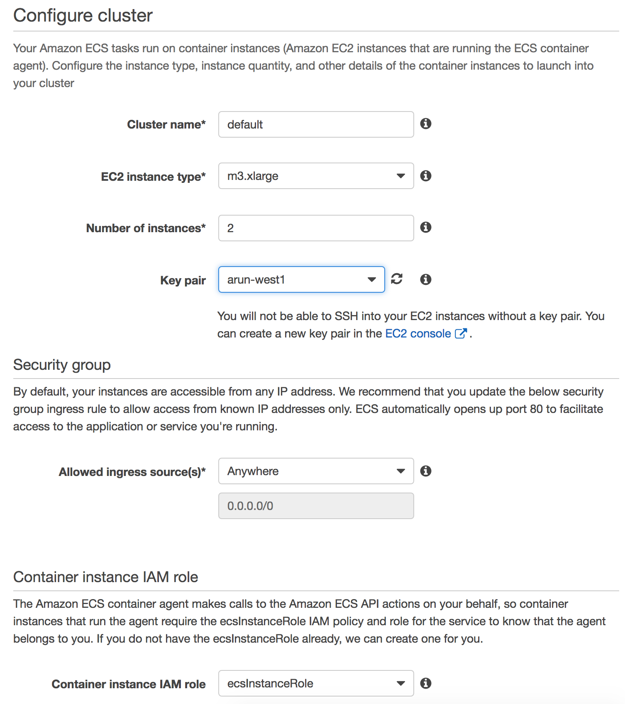
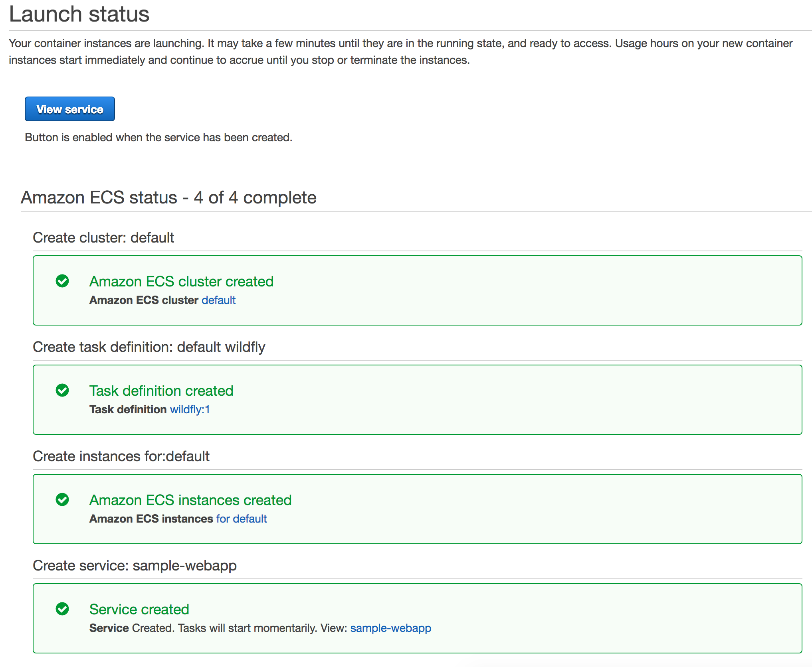
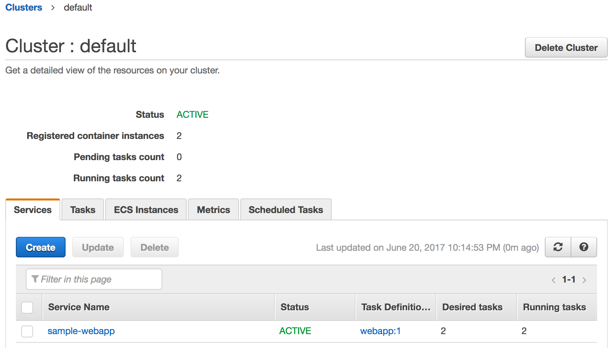
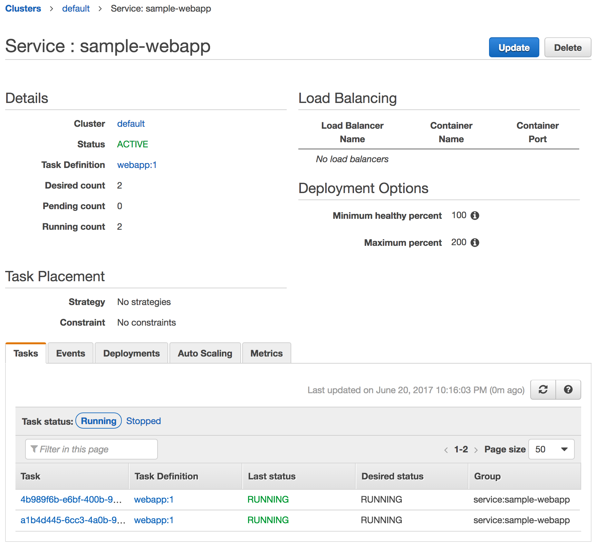

= Getting Started with Amazon EC2 Container Service (ECS)

== ECS Basic Concepts

Container Instance:: An AMI instance that is primed for running containers. By default, each Amazon instance uses Amazon ECS-Optimized Linux AMI. This is the recommended image to run ECS container service. The key components of this base image are:
. Amazon Linux AMI
. Amazon ECS Container Agent – manages containers lifecycle on behalf of ECS and allows them to connect to the cluster
. Docker Engine

Task:: A task is defined as a JSON file and describes an application that contains one or more container definitions. This usually points to Docker images from a registry, port/volume mapping, etc.

Service:: ECS maintains the "`desired state`" of your application. This is achieved by creating a service. A service specifies the number of instances of a task definition that needs to run at a given time. If the task in a service becomes unhealthy or stop running, then the service scheduler will bounce the task. It ensures that the desired and actual state are match. This is what provides resilience in ECS.New tasks within a Service are balanced across Availability Zones in your cluster. Service scheduler figures out which container instances can meet the needs of a service and schedules it on a valid container instance in an optimal Availability Zone (one with the fewest number of tasks running).

== ECS Cluster

This section will show how to:

- Create an ECS cluster
- Create a task definition
- Create a service using that task
- Start tht service in the cluster

Let's get started.

. Go to https://us-west-1.console.aws.amazon.com/ecs/home?region=us-west-1#/getStarted[AWS Console for ECS]
. Click on `Get Started`, select `Deploy a sample application onto an Amazon ECS Cluster`. This exercise does not require to deploy images to ECR and so unselect that.
. Create a task definition:
+

+
Click on `Next Step`.
+
. Create a service definition:
+

+
Click on `Next Step`.
+
. Configure cluster:
+

+
Click on `Review & Launch`.
+
. Click on `Launch instance & run service`. It takes a few seconds for the cluster to be created and then it shows the following output:
+

+
. Wait for a few minutes for the Docker image to be downloaded to EC2 instances. Two task instances in the service are then started.
+

+
. Click on the Service Name to see more details about the tasks running in this service:
+

== EC2 Container Registry

- Build a Docker Image
- Push and Pull images to EC2 Container Registry using Maven

== Application with Multiple Tasks

TBD

== Service Discovery

TBD

== CI/CD using Jenkins + ECS Plugin

TBD

== CI/CD using CodePipeline + ECS

TBD

== X-Ray + ECS

TBD

== Stateful Containers

TBD

